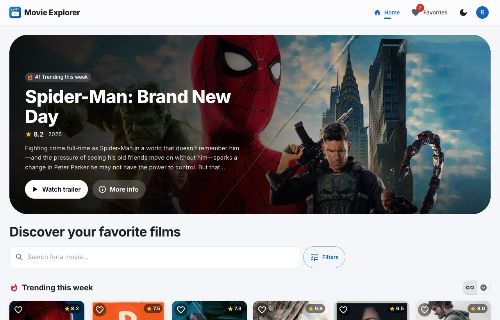
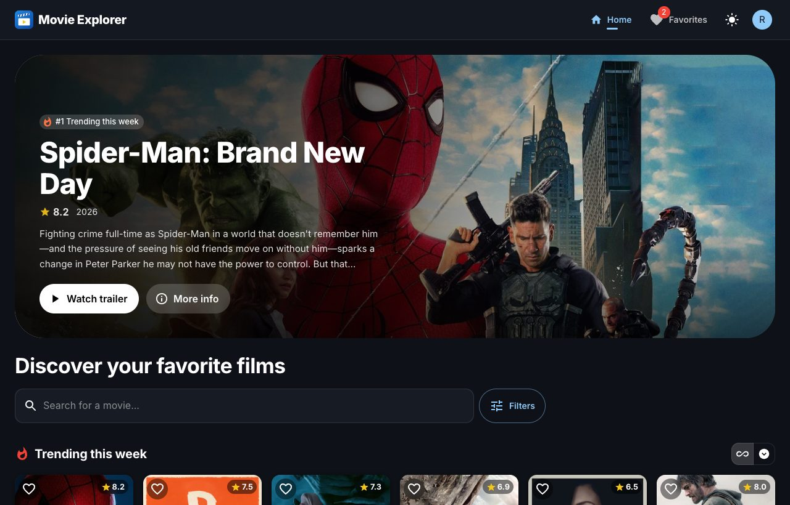
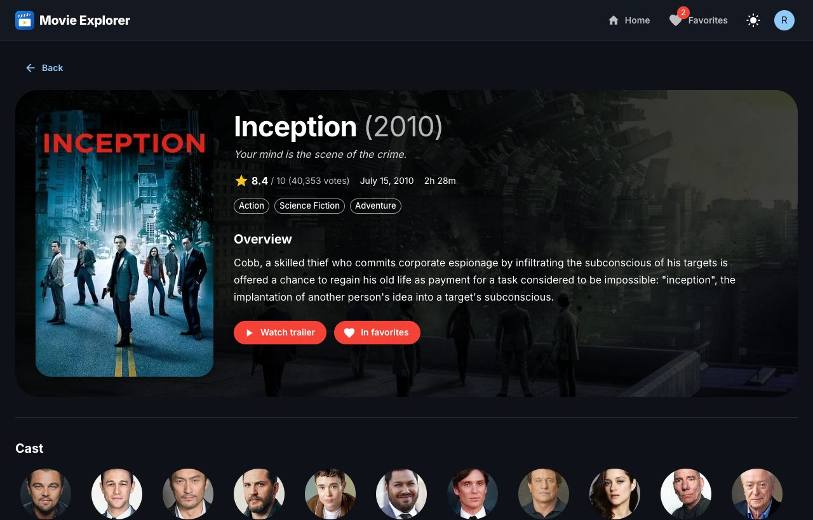
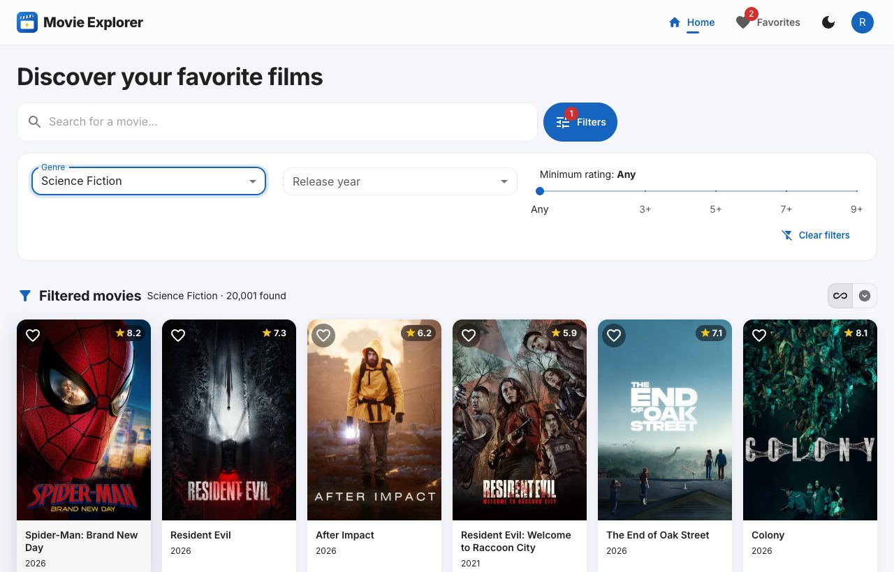
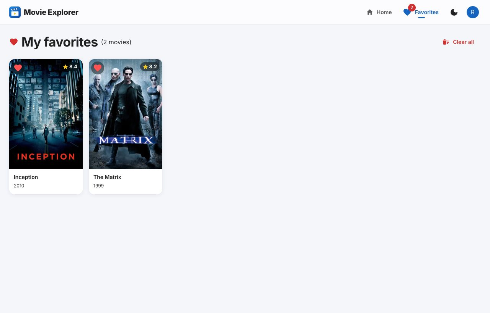
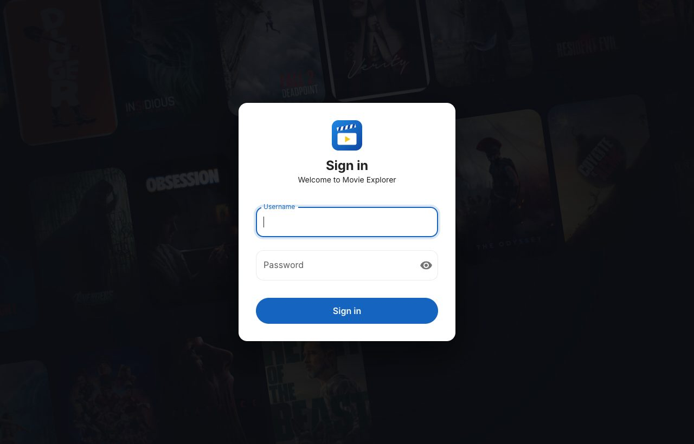
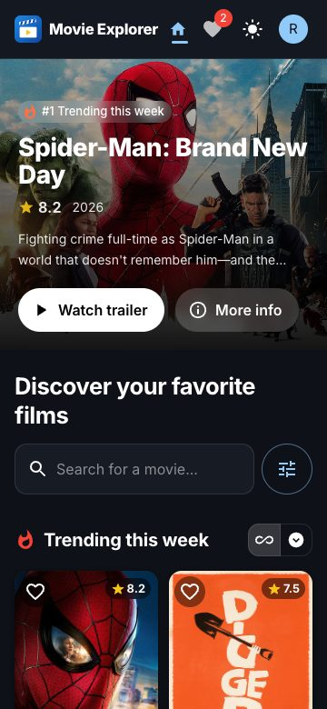
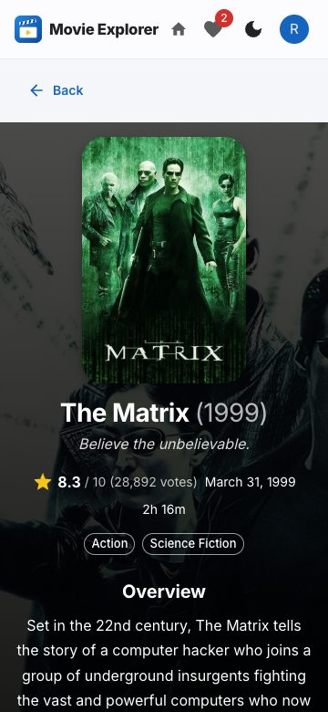

# 🎬 Movie Explorer – Discover Your Favorite Films

A responsive React web app to search for movies, view their details and discover trending films, using real-time data from [The Movie Database (TMDb) API](https://developer.themoviedb.org/docs).

**🔗 Live demo:** [movie-explorer-wheat-mu.vercel.app](https://movie-explorer-wheat-mu.vercel.app)

**📦 Repository:** [GitLab](https://gitlab.com/ruwantha-bandara/movie-explorer) · mirrored on [GitHub](https://github.com/ruwanthac/movie-explorer)

> Sign in with any username (3+ characters) and password (6+ characters).



---

## Contents

- [Features](#features)
- [Screenshots](#screenshots)
- [Tech stack](#tech-stack)
- [Getting started](#getting-started)
- [How the TMDb API is used](#how-the-tmdb-api-is-used)
- [Project structure](#project-structure)
- [State management](#state-management)
- [Testing](#testing)
- [Notes and design decisions](#notes-and-design-decisions)
- [Development workflow](#development-workflow)
- [Author](#author)

---

## Features

### Core requirements

| Requirement | Status | Details |
|---|:---:|---|
| User login (username and password) | ✅ | Form validation, show/hide password, protected routes, logout |
| Search bar | ✅ | Searches as you type (debounced), clear button, results count |
| Grid of movie posters | ✅ | Title, release year and rating on every card; responsive columns |
| Movie details view | ✅ | Overview, genres, cast with photos, runtime, release date, rating, trailer |
| Trending movies section | ✅ | This week's trending movies from TMDb |
| Light / dark mode | ✅ | Follows the system setting on first visit, then remembers the choice |
| TMDb API integration | ✅ | Trending, search, movie details (plus genres and discover for filters) |
| Infinite scrolling for search results | ✅ | Also works for trending and filtered results |
| Graceful API error handling | ✅ | Friendly messages for offline, timeouts, rate limits, invalid key, etc., with Retry |
| React Context API for movie data | ✅ | `useReducer` + Context for movies, auth, theme and notifications |
| Last searched movie in localStorage | ✅ | Restored with its results when the app is opened again |
| Favorite movies stored locally | ✅ | Heart button on every card and on the details page; Favorites page |

### Bonus features

| Feature | Status | Details |
|---|:---:|---|
| Filter by genre, year or rating | ✅ | Filter panel using TMDb's discover endpoint; filters can be combined |
| YouTube trailers | ✅ | Plays inside the app in a pop-up player (privacy-enhanced `youtube-nocookie.com`) |
| "Load More" button | ✅ | Toggle between infinite scroll and a Load More button; the choice is remembered |

### Extras

- **Featured banner** on the home page for the #1 trending movie, with Watch trailer / More info
- **Mobile-first, responsive design**, checked at phone (360px), tablet (768px) and desktop (1280px) sizes
- **Accessibility:** "Skip to content" link, visible keyboard focus, labelled buttons, screen-reader friendly status messages, reduced-motion support
- **Offline banner** and a clear warning if the TMDb API key is not configured
- **Error boundary**: an unexpected crash shows a friendly page instead of a blank screen
- **Loading skeletons**, smooth fade-ins and hover effects
- Descriptive **browser tab titles** for every page
- **81 automated tests**

---

## Screenshots

| Home (dark mode) | Movie details |
|---|---|
|  |  |

| Filters | Favorites |
|---|---|
|  |  |

| Login | Mobile – home | Mobile – details |
|---|---|---|
|  |  |  |

---

## Tech stack

| | |
|---|---|
| **Framework** | React 19 (Create React App) |
| **UI library** | Material-UI (MUI) v9 with Emotion |
| **Routing** | React Router v7 |
| **HTTP client** | axios (with request/response interceptors) |
| **State management** | React Context API + `useReducer` |
| **Testing** | Jest + React Testing Library |
| **Deployment** | Vercel |

---

## Getting started

### Prerequisites

- [Node.js](https://nodejs.org/) 18 or newer
- A free **TMDb API key**

### 1. Get a TMDb API key

1. Create a free account at [themoviedb.org](https://www.themoviedb.org/signup) and verify your email.
2. Go to **Settings → API** ([direct link](https://www.themoviedb.org/settings/api)) and request a **Developer** key.
3. Copy the **API Key** (the short 32-character value, not the long "Read Access Token").

### 2. Install and configure

```bash
git clone https://gitlab.com/ruwantha-bandara/movie-explorer.git
cd movie-explorer
npm install

# Create your environment file and add your API key to it
cp .env.example .env
```

`.env` should contain:

```
REACT_APP_TMDB_API_KEY=your_api_key_here
```

> `.env` is listed in `.gitignore`, so the key is never committed.

### 3. Run

```bash
npm start        # Development server at http://localhost:3000
npm test         # Run the test suite (watch mode)
npm run build    # Production build in the build/ folder
```

Sign in with **any username (3+ characters) and password (6+ characters)**. See [Notes and design decisions](#notes-and-design-decisions).

---

## How the TMDb API is used

All requests go through one axios instance in [`src/api/tmdb.js`](src/api/tmdb.js) using the TMDb **v3** API (`https://api.themoviedb.org/3`).

| Function | Endpoint | Used for |
|---|---|---|
| `getTrendingMovies(page)` | `GET /trending/movie/week` | Trending section, featured banner, login background |
| `searchMovies(query, page)` | `GET /search/movie` | Search results (with infinite scroll) |
| `getMovieDetails(id)` | `GET /movie/{id}?append_to_response=credits,videos` | Details page: info, cast and trailers in **one** request |
| `getGenres()` | `GET /genre/movie/list` | Genre filter options |
| `discoverMovies(filters, page)` | `GET /discover/movie` | Filtering by genre, release year and minimum rating |

Images are loaded from TMDb's image CDN (`https://image.tmdb.org/t/p/{size}{path}`) in a size suited to each place (posters `w342`, backdrops `w1280`, cast photos `w185`).

**Interceptors:**

- **Request:** adds the API key to every request. If the key is missing, the request is stopped with a clear "API key is missing" message instead of failing with a confusing 401.
- **Response:** turns failures into friendly messages ([`src/api/errors.js`](src/api/errors.js)):

| Situation | Message shown |
|---|---|
| No internet | "You appear to be offline. Check your internet connection." |
| Timeout (10s) | "The request took too long. Please try again." |
| 401 | "The TMDb API key is invalid…" |
| 404 | "Movie not found" page |
| 429 | "Too many requests. Please wait a moment and try again." |
| 5xx | "The movie database is having problems right now…" |

Other details:

- **Requests are cancelled** with `AbortController` when they are no longer needed (e.g. the user types a new search or leaves the page).
- **Late responses are ignored**, so results for an old search or old filters never replace newer ones.
- **Movie details are cached**, so going back to a movie does not fetch it again.

---

## Project structure

```
movie-explorer/
├── public/                 # index.html, app icons, manifest
├── docs/screenshots/       # Images used in this README
└── src/
    ├── api/                # TMDb client (axios instance, endpoints) and error messages
    ├── components/         # Reusable UI: MovieCard, MovieGrid, SearchBar, FilterPanel,
    │                       #   FeaturedBanner, TrailerDialog, Navbar, ErrorBoundary, ...
    ├── context/            # AuthContext, MovieContext, ThemeContext, NotificationContext
    ├── hooks/              # useDebounce, useInfiniteScroll, useOnlineStatus,
    │                       #   usePaginationMode, useDocumentTitle
    ├── pages/              # Home, MovieDetails, Favorites, Login, NotFound
    ├── utils/              # Constants, formatters (year, rating, runtime, trailer), localStorage helpers
    ├── tests/              # App tests, one file per feature
    ├── testUtils/          # Shared test helpers and mocks
    ├── theme.js            # MUI light/dark theme and component styles
    └── App.js              # Providers and routes
```

### Routes

| Path | Page | Access |
|---|---|---|
| `/login` | Sign in | Public |
| `/` | Home: featured banner, search, filters, trending | Signed-in users |
| `/movie/:id` | Movie details | Signed-in users |
| `/favorites` | Saved favorites | Signed-in users |
| `*` | 404 page | Signed-in users |

---

## State management

State is managed with the **React Context API**. Each context has a single responsibility:

| Context | Holds | Persisted in localStorage |
|---|---|---|
| `MovieContext` (`useReducer`) | Trending, search results, filters and filtered results, genres, cached movie details, favorites | Last search, favorites |
| `AuthContext` | Signed-in user, `login` / `logout` | Username only (never the password) |
| `ThemeContext` | Light / dark mode | Theme choice |
| `NotificationContext` | Snackbar messages (e.g. "Added to favorites") | – |

`MovieContext` uses a reducer with explicit actions (`SEARCH_REQUEST`, `SEARCH_SUCCESS`, `FAVORITE_ADD`, …). Paginated lists share one shape (`items`, `page`, `totalPages`, `loading`, `error`), and new pages are appended with duplicates removed.

---

## Testing

```bash
npm test                         # Watch mode
CI=true npm test                 # Run once
```

**81 tests** across 17 test files, using Jest and React Testing Library. TMDb calls are mocked, so the tests run without an API key or internet connection.

They cover login and protected routes, search (debounce, saved last search, errors), infinite scroll and Load More, movie details, favorites, filters, the featured banner, trailers, error messages, the error boundary, offline and missing-key banners, page titles and accessibility, plus unit tests for the reducer, formatters and error handling.

---

## Notes and design decisions

- **Login is frontend-only.** The task does not include a backend, so any username (3+ characters) and password (6+ characters) signs in. Only the username is stored, never the password. With a real backend, `AuthContext` would call an auth API and store a token instead.
- **Filters are hidden while searching.** TMDb's search endpoint cannot filter by genre or rating, so filters apply when browsing and the search box is used on its own.
- **Infinite scroll and "Load More" both exist.** Infinite scroll is the default (core requirement), and the bonus "Load More" button can be switched on with the toggle next to each list.
- **Minimum rating filter** also requires at least 50 votes, so films with a single 10/10 vote don't flood the results.
- **TMDb returns at most 500 pages** for any list, so loading stops there.
- **The TMDb API key is visible in the deployed site.** Create React App builds environment variables into the JavaScript bundle, so anyone can read the key in the browser. This is normal for frontend-only apps using TMDb (keys are free and read-only). To hide it, requests would go through a small backend proxy, which is outside the scope of this task.
- **Create React App** is used as the task requires. CRA is no longer actively maintained; a new project today would likely use Vite.

---

## Development workflow

The project was built feature by feature using a Git Flow style branching model:

- **`main`**: production. Every merge deploys to Vercel. Releases are tagged (`v1.0.0`).
- **`develop`**: integration branch.
- **`feature/*`**, **`docs/*`**, **`chore/*`**: one branch per feature, merged into `develop` through a pull request with a merge commit, so each feature's individual commits stay visible.

Commit messages follow [Conventional Commits](https://www.conventionalcommits.org/) (`feat:`, `fix:`, `test:`, `docs:`, `style:`, `refactor:`, `chore:`).

The full history, including every merge, is in both repositories. The **pull requests** with a description of each feature are on GitHub: [github.com/ruwanthac/movie-explorer/pulls?q=is:pr](https://github.com/ruwanthac/movie-explorer/pulls?q=is%3Apr).

---

## Author

**Ruwantha Bandara**

- GitHub: [@ruwanthac](https://github.com/ruwanthac)
- LinkedIn: [ruwanthabandara](https://www.linkedin.com/in/ruwanthabandara)
- Email: [ruwanthacbandara@gmail.com](mailto:ruwanthacbandara@gmail.com)

---


This product uses the TMDB API but is not endorsed or certified by TMDB.
